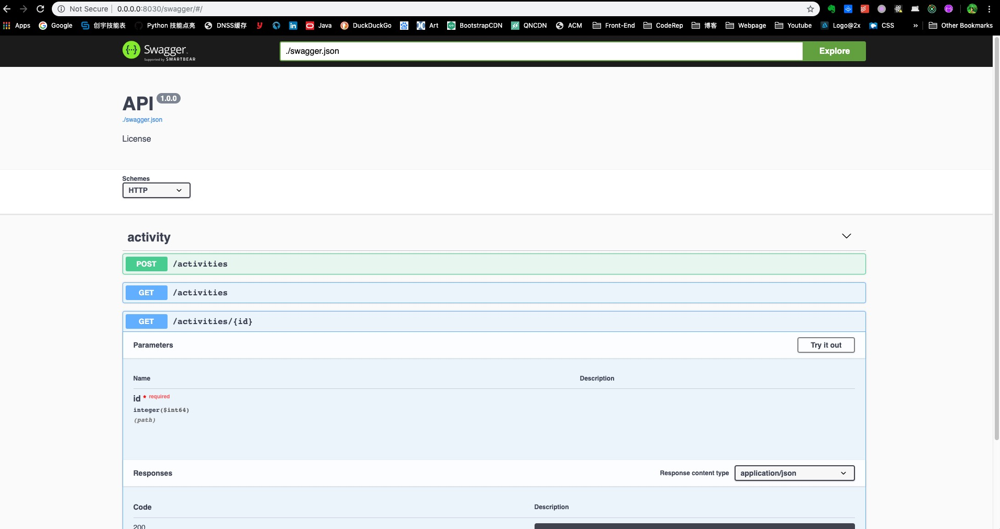
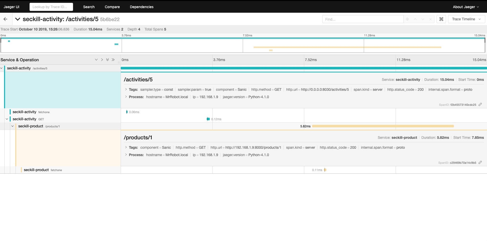
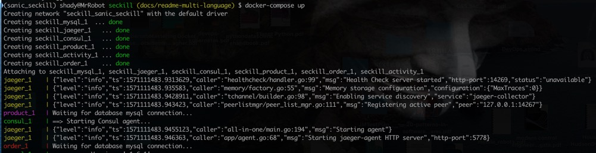
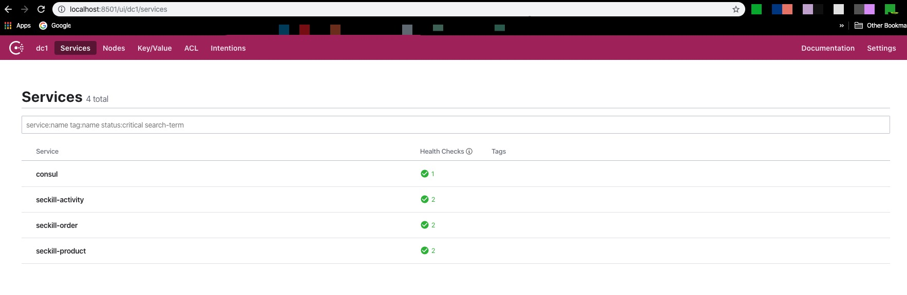

# Seckill-Sanic

![MIT][MIT]

`English` | [简体中文][简体中文]

[English]: README.md
[简体中文]: README.zh-Hans.md
[Sanic]: https://sanicframework.org/
[MIT]: https://img.shields.io/github/license/itechub/PROnunciation.svg

A simple seckill scenario implemented by [`Sanic`][Sanic] web framework, using microservices style.
This project simulate a simple seckill scenario, which is consist of three microservices as follow:

* Product Service
  * any user can query products and product details
  * any user can add/delete/edit product instance
* Activity Service
  * any user can query activities and activity details
  * any user can add/delete/edit activity instance
  * any user can participate seckill activity to place an order with unique user id.
* Order Service
  * user can query their orders, identify by unique user id
  * user can view/delete order details

## Original Requirements Description

> Write an web api service to simulate users' participation of a seckill activity:
>
> * Provide a web API, based on HTTP or TCP, which users can place their order for specific activity
> * User can send request over once to the same activity, and the server side should ensure that only one order is being placed when conditions are met. (only when there are products left)
> * The orders info should be persistent even when the service or machine is being restarted
> * Each activity only related to one product, user can only place order when activity's product inventory > 0
> * The final products sum up within orders should be equivalent to inventory of the products
> * The service should be able to handle large amount concurrent requests from multiple users (etc. 100 TPS)

## Features

* **Using [Sanic][sanic] , Async Python 3.6+ web server/framework | Build fast. Run fast**
* **Using [aiomysql][aiomysql] as database driver, to execute sql statement asynchronously**
* **Using [aiohttp][aiohttp] as client to issue async http requst, interacting with other microservices.**
* **Using [peewee][peewee] as ORM，Only for modeling and data model migrations**
* **Using [sanic-opentracing][sanic-opentracing] as distributed tracing system implementation**
* **Using [sanic-openapi][sanic-openapi] to auto generate Swagger API documentation**

[sanic]: https://github.com/huge-success/sanic
[aiomysql]: https://github.com/aio-libs/aiomysql
[aiohttp]:https://github.com/aio-libs/aiohttp
[peewee]: https://github.com/coleifer/peewee
[sanic-opentracing]: https://github.com/shady-robot/sanic-opentracing
[sanic-openapi]: https://github.com/huge-success/sanic-openapi

## Screenshots

### Swagger API



### Jaeger Server



## Environment

### Docker-Compose Environment

#### Configure environment variables via `.env`

Create your local `.env` file, you can use the `.env_template` as a starting point.

```conf
DOCKER_DIR=~/you/project/patch/sanic_seckill/seckill/deployment
MYSQL_ROOT_PASSWORD=sanicroot
```



#### Start all services

Build and start all services with the following command using docker-compose. You can adjust the port mapping or other setting by editing the `docker-compose.yml` file.

```shell
docker-compose build
docker-compose up
```

#### Access services

By default, docker-compose will bind services port to local host machine. Change any port mapping as you like by editing `docker-compose.yml` file.

* Consul UI:  `http://localhost:8501`
* Jaeger UI:  `http://localhost:8502`
* Product Service:  `http://localhost:8503`
* Activity Service:  `http://localhost:8504`
* Order Service:  `http://localhost:8505`

If everything works as expected, you can see all three microservices are registered with healthy check status in `Consul` web GUI.

By default, `TRACE_ALL` is set to `true` within the `activity service`, which is configured in `docker-compose.yml`, so when you make request to `activity service`, you can view all request trace in `Jaeger` web GUI.



### Local environment setup

#### docker volume

#### Python virtualenv

## Technical implementation

### Server

#### Before server starts

* Create DB connection pool
* Create client connection session，to interact with other services
* Create `jaeger.tracer` to implement distributed tracing over requests

#### Middlewares

* Implement request middleware to add specific HTTP headers, handle CORS request
* Add an envelop to response, uniform all response data format

#### Exceptions

Intercept with exception, and response with uniform format.

#### Service Registration

Create ServiceWatcher Task, for service discovery and service healthy status check, all services are maintained to `app.services` list.

### Data Model

> Using peewee as ORM backend, only for data model design and data migration, using `aiomysql` for async SQL operation.

* All DB connection configurations are configured by environment variables
* If you are using `docker-compose`, you don't have to create DB table manually
* Otherwise you need to run `python migrations.py` to migrate DB table

### Database Operation

Using `aiomysql` as database connector, all sql related operation are capsulated by `DBConnection`, to execute raw sql asynchronously,

* `acquire()` returns a non-transaction SQL connection. Used for query which is optimized for efficiency.
* `tansaction()` as transaction function, all delete/insert related SQL should use transaction when needed.
* If `trace` is set to `true`, all DB operation will being traced.

### HTTP Async Request Client

Using `client` within `aiohttp` package, capsulating to provide common utilities for accessing other microservices asyncronously.

### Logging

Using `Python logging` module, `logging,yml` as configuration file, `JsonFormatter` will transform logs into json format.

### Distributed Tracing System

* OpenTracing is built around by Dapper, Zipkin, which bring us a standard for distributed tracing system
* Opentracing will trace every request within your service, and every related service, which plays an critical part for analysis of microservice performance
* Implementing opentracing standard, and use Jaeger as tracer
* Tracing behaviors(DB, Client) can be configured by environment variables

### Handling Exceptions

Using `app.error_handler = CustomHander()` to handle exceptions.

* `code`: status code, `0` for success, and other for exceptions.
* `message`: error message
* `status_code`: standard HTTP status code
